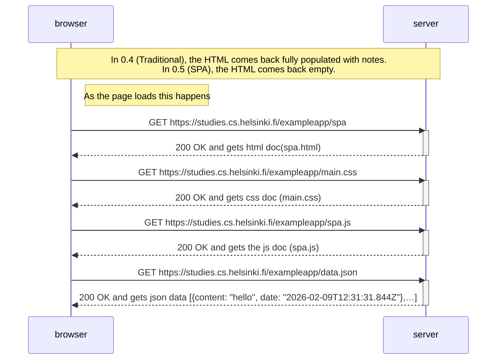

```mermaid

sequenceDiagram

    participant browser
    participant server

    Note over browser, server: In 0.4 (Traditional), the HTML comes back fully populated with notes.<br/> In 0.5 (SPA), the HTML comes back empty.


    Note right of browser: As the page loads this happens
    browser->>server: GET https://studies.cs.helsinki.fi/exampleapp/spa

    activate server
    server-->>browser: 200 OK and gets html doc(spa.html)
    deactivate server

    browser->>server: GET https://studies.cs.helsinki.fi/exampleapp/main.css

    activate server
    server-->>browser: 200 OK and gets css doc (main.css)
    deactivate server

    browser->>server: GET https://studies.cs.helsinki.fi/exampleapp/spa.js

    activate server
    server-->>browser: 200 OK and gets the js doc (spa.js)
    deactivate server

    browser->>server: GET https://studies.cs.helsinki.fi/exampleapp/data.json

    activate server
    server-->>browser: 200 OK and gets json data [{content: "hello", date: "2026-02-09T12:31:31.844Z"},…]
    deactivate server


```
